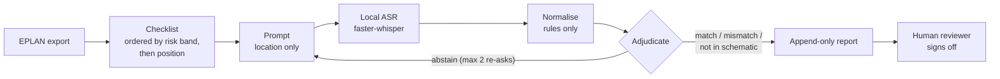

# AI Inspection Agent

**Voice-guided inspection of an electrical control cabinet, checked against its schematic.**

A trainee inspecting a finished cabinet is prompted by location only ("left frame, row 3, position 1") and reads the label aloud. The system transcribes the read locally, compares it with the schematic, and flags every disagreement with a reason a reviewer can act on. Unclear audio triggers a silent re-ask instead of a guess. Confirmed mismatches become *redlines*: corrections sent upstream to the schematic.

> **Advisory only.** The system flags and explains; it never passes or fails a cabinet. A qualified person reviews every flag and signs off.

Scope: one cabinet (EPLAN project 20160387), 70 checklist items: 62 devices and 8 terminal strips.

## How it works



Design principles:

- **Location-only prompts.** The expected value stays hidden until the verdict is fixed, so the system never primes the trainee.
- **A deterministic judge.** Reads are compared by string equality against the closed set of legal values. There is no fuzzy matching and no LLM, so a misread is never "corrected" into a valid-looking value.
- **Four outcomes:** `match`, `mismatch`, `not_in_schematic`, `abstain`.
- **Nothing is lost.** The run never stops, flags cannot be closed or deleted, and audio is kept for every attempt.
- **Local speech recognition.** Audio never leaves the machine.

## Quickstart

Requires Python 3.11 and [uv](https://docs.astral.sh/uv/). Developed on Windows 11.

```bash
git clone https://github.com/Suhas2204/AI-Inspection-Agent.git
cd AI-Inspection-Agent
uv sync
uv run pytest                                          # test suite
uv run python -m redlining.session --scripted          # smoke test, no microphone
```

A live run at the cabinet needs a microphone and an interactive terminal (press Enter to start and stop each recording):

```bash
uv run python -m redlining.session --live --model small --speak
```

| Option | Effect |
|---|---|
| `--mode tag \| part` | Read the device tag (default), or the part number and rating line |
| `--kind device \| strip \| all` | Restrict the run to one item kind |
| `--model` | faster-whisper size: `tiny` to `large-v3` |
| `--speak` | Read prompts aloud |

Each run writes `runs/<timestamp>/` with `report.md`, `report.json`, attempt logs and audio.

## Status

Research prototype. **Evaluation is in progress; no performance results are claimed yet.**

| Block | Component | State |
|---|---|---|
| 1 | Loader: clean the raw export | Implemented; gate re-run pending |
| 2 | Position: rails to rows | Passed, walked at the cabinet |
| 3 | Checklist and risk bands | Passed |
| 4 | Normaliser | Passed |
| 5 | Speech recognition check | Partial: strip-count speech not yet scored |
| 6 | Adjudicator | Passed |
| 7 | Inspection session | Passed for tags; strip path unresolved |
| 8 | Flags and report | Passed |
| 9 | Evaluation | Not started |
| 10 | Redlines | Not started |

## Limitations

- **Tag-only reading cannot see a wrong part under a correct label.** For example, a B16 breaker fitted where a B10 belongs goes undetected. Detection rates will be reported as conditional on this.
- **Strip checks count terminals by function** (N / L / PE). A terminal swapped for another of the same function is invisible.
- **Single cabinet, single evaluator.** Faults are planted and scored by the author without blinding, and no manual baseline is run.
- **Speech is English;** accented, non-native speakers are assumed.

Full rationale, assumptions and open questions: [CONTEXT.md](CONTEXT.md). Per-block outcomes: [DECISIONS.md](DECISIONS.md).

## Repository structure

| Path | Contents |
|---|---|
| `src/redlining/` | The pipeline, one module per block |
| `tests/` | pytest suite |
| `experiments/block05_asr/` | ASR transcription and tag-confusability scripts |
| `data/` | Cabinet export, bands, walking order, transcripts |
| `runs/` | Run outputs (generated, not tracked) |

## Citation

```bibtex
@misc{jagtap2026aiinspectionagent,
  author       = {Suhas Jagtap},
  title        = {{AI Inspection Agent}: Voice-Guided Inspection of Electrical Control Cabinets},
  year         = {2026},
  howpublished = {\url{https://github.com/Suhas2204/AI-Inspection-Agent}},
  note         = {Master's thesis project}
}
```

## License

The source code is released under the [MIT License](LICENSE).

The cabinet data and media (`data/`, `Cabinet_Components_Overview.jpeg`, `BLOCK_GUIDE.pdf`) are included for reproducibility only. They are **not** covered by the MIT License and may not be reused without permission.
