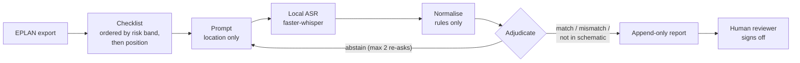

# AI Inspection Agent

**Voice-guided inspection of an electrical control cabinet, checked against its schematic.**

A trainee inspecting a finished cabinet is prompted by location only ("left frame, row 3, position 1") and reads the label aloud. The system transcribes the read locally, compares it with the schematic, and flags every disagreement with a reason a reviewer can act on. Unclear audio triggers a silent re-ask instead of a guess. Confirmed mismatches become *redlines*: corrections sent upstream to the schematic.

> **Advisory only.** The system flags and explains; it never passes or fails a cabinet. A qualified person reviews every flag and signs off.

Scope: one cabinet (EPLAN project 20160387), 70 checklist items: 62 devices and 8 terminal strips.

## About this repository

This is the software artefact of a master's thesis at the Institute for Factory Automation and Production Systems (FAPS), Friedrich-Alexander-Universität Erlangen-Nürnberg, by Suhas Jagtap. The thesis asks whether a voice-driven assistant can help a trainee find schematic discrepancies in a control cabinet without ever telling them what to expect, and reports the evaluation in Chapter 5. Everything in that chapter is computed by the scripts in this repository from one recorded run, `runs/20260927-130613`, whose data is committed here. [REPRODUCE.md](REPRODUCE.md) lists the exact command behind every number and figure.

> **Thesis title and submission date: to be filled in before handing this repository over.**

Design rationale, assumptions and open questions live in [docs/CONTEXT.md](docs/CONTEXT.md); per-block outcomes in [docs/DECISIONS.md](docs/DECISIONS.md); the data provenance and its GDPR status in [data/README.md](data/README.md).

## How it works


```mermaid
flowchart LR
    A["EPLAN export"] --> B["Checklist<br/>ordered by risk band,<br/>then position"]
    B --> C["Prompt<br/>location only"]
    C --> D["Local ASR<br/>faster-whisper"]
    D --> E["Normalise<br/>rules only"]
    E --> F{"Adjudicate"}
    F -- "abstain (max 2 re-asks)" --> C
    F -- "match / mismatch /<br/>not in schematic" --> G["Append-only report"]
    G --> H["Human reviewer<br/>signs off"]
```

Design principles:

- **Location-only prompts.** The expected value stays hidden until the verdict is fixed, so the system never primes the trainee.
- **A deterministic judge.** Reads are compared by string equality against the closed set of legal values. There is no fuzzy matching and no LLM, so a misread is never "corrected" into a valid-looking value.
- **Four outcomes:** `match`, `mismatch`, `not_in_schematic`, `abstain`.
- **Nothing is lost.** The run never stops, flags cannot be closed or deleted, and audio is kept for every attempt.
- **Local speech recognition.** Audio never leaves the machine.

## Installation

Requires Python 3.11 and [uv](https://docs.astral.sh/uv/). Developed on Windows 11.

```bash
git clone https://github.com/Suhas2204/AI-Inspection-Agent.git
cd AI-Inspection-Agent
uv sync
uv run pytest                                          # 58 tests, no hardware needed
```

`uv sync` installs the runtime dependencies and the `dev` group, which adds pytest and matplotlib. Nothing here needs a GPU or a network connection: speech recognition is `faster-whisper` running locally, and the model downloads on first use.

The only optional credential is `OPENAI_API_KEY`, used by `experiments/block05_asr/transcribe.py` to compare the local recogniser against the hosted Whisper API. Every other script, and the inspection session itself, runs without it.

## Running an inspection session

Two front ends, one engine. Both call `session.step_item`, so they cannot drift apart.

**Terminal**

```bash
uv run python -m redlining.session --scripted          # smoke test, no microphone
uv run python -m redlining.session                     # typed input
uv run python -m redlining.session --live --model small --speak
```

A live run needs a microphone and an interactive terminal (press Enter to start and stop each recording).

**Streamlit**

```bash
uv run streamlit run app.py
```

The page records each clip in the browser, transcribes it locally and shows the verdict. The four tabs read the run folder the session is writing; only the flag annotations write anything, and they are additive.

| Option | Effect |
|---|---|
| `--mode tag \| part` | Read the device tag (default), or the part number and rating line |
| `--kind device \| strip \| all` | Restrict the run to one item kind |
| `--model` | faster-whisper size: `tiny` to `large-v3` |
| `--speak` | Read prompts aloud |
| `--max-reasks` | Silent re-asks allowed after an abstain (default 2, so 3 attempts) |
| `--tag-edit-max` | Tags this near the expected value abstain instead of not-in-schematic (default 1) |
| `--part-edit-max` | The same threshold for part numbers (default 2) |

Each run writes `runs/<timestamp>/` with `report.md`, `report.json`, attempt logs and audio. Run folders are not tracked, with one deliberate exception described in [data/README.md](data/README.md).

## Evaluating a run

All three scripts are read-only with respect to `runs/`: a scorer that can alter a run is a scorer an examiner cannot trust.

**The scorer** — detection rate, precision and abstention for one run against the planted fault set.

```bash
uv run python -m redlining.score runs/20260927-130613           # human-readable
uv run python -m redlining.score runs/20260927-130613 --json    # machine-readable
uv run python -m redlining.score runs/20260927-130613 --latex   # thesis table
```

The definitions — planted, caught, missed, not walked, false flag, known miss — are fixed in the module docstring of `src/redlining/score.py` so the thesis and the code cannot disagree about them. A label swap is one fault at two positions, caught from either end.

**The risk–coverage sweep** — metric 3. Re-judges the saved transcripts at several edit-distance thresholds and re-ask budgets and reports coverage against risk.

```bash
uv run python experiments/block09_eval/risk_coverage.py runs/20260927-130613
uv run python experiments/block09_eval/risk_coverage.py runs/20260927-130613 --lang de
```

`--lang en` writes the working figure as a PNG; `--lang de` writes the thesis plate as a vector PDF, set to the FAPS rules. The sweep prints its own checks: that the replay reproduces the run's recorded outcomes at the default settings, and that its baseline row equals the scorer's on the untouched report.

**The character error rate** — metric 5. Aligns what was heard against the walker card, character by character.

```bash
uv run python experiments/block05_asr/score.py runs/20260927-130613
uv run python experiments/block05_asr/score.py runs/20260927-130613 --all-characters
```

The reference is the card, not the schematic: the card already carries the planted faults, so hearing a planted wrong tag correctly counts as a hit.

**The confusability map** — metric 4. A property of the schematic alone; needs no run.

```bash
uv run python experiments/block09_eval/confusability.py
```

## Metrics

Defined before measurement, in priority order (docs/CONTEXT.md §12). "Computed in" is the script that actually produces the number today.

| # | Metric | Question it answers | Computed in | State |
|---|---|---|---|---|
| **M1** | Redline precision | Of flags raised, how many are genuine schematic errors worth sending upstream? | `src/redlining/score.py` | **Provisional.** The script counts a flag at an unplanted position as false; only replaying the audio settles whether the walker misread a correct label. The dedicated adjudication script CONTEXT names (`block09_eval/redlines.py`) is not written. |
| **M2** | Detection rate | Of planted faults, how many are flagged? | `src/redlining/score.py` | Computed |
| **M3** | Risk–coverage curve | How much does error fall as the system is allowed to abstain more? | `experiments/block09_eval/risk_coverage.py` | Computed |
| **M4** | Confusability map | Which device tags are close enough that a one-character misread yields a different *legal* tag? | `experiments/block09_eval/confusability.py` | Computed |
| **M5** | ASR character accuracy | Does the recogniser hear the tag, and which character does it lose? | `experiments/block05_asr/score.py` | Computed |
| **M6** | Time per cabinet | Does a run fit inside the working shift? | `RunLog.duration_s`, reported in `report.json` | Recorded |

**What none of these can claim.** All six are computed by the author, on one cabinet, against faults the author planted, using the schematic as ground truth — which is precisely what a redline denies. See the limitations below and CONTEXT §12.

## Status

Research prototype, submitted with the thesis.

| Block | Component | State |
|---|---|---|
| 1 | Loader: clean the raw export | Passed; gate 173/92/31/100 |
| 2 | Position: rails to rows | Passed, walked at the cabinet |
| 3 | Checklist and risk bands | Passed |
| 4 | Normaliser | Passed |
| 5 | Speech recognition check | Passed for tags; strip-count speech not scored |
| 6 | Adjudicator | Passed |
| 7 | Inspection session | Passed for tags; strip path unresolved |
| 8 | Flags and report | Passed |
| 9 | Evaluation | M2–M6 computed; M1 provisional |
| 10 | Redlines | Not started |

## Limitations

- **Tag-only reading cannot see a wrong part under a correct label.** A B16 breaker fitted where a B10 belongs goes undetected. Detection rates are conditional on this.
- **Strip checks count terminals by function** (N / L / PE). A terminal swapped for another of the same function is invisible, and the strip counts are the one place the evaluated run makes errors in both directions.
- **M1 is provisional.** Precision is reported against positions where nothing was planted, without replaying the audio to separate a genuine finding from a misread.
- **Single cabinet, single evaluator.** Faults are planted and scored by the author without blinding, and no manual baseline is run.
- **Speech is English;** accented, non-native speakers are assumed.

## Repository structure

| Path | Contents |
|---|---|
| `src/redlining/` | The pipeline, one module per block |
| `app.py` | Streamlit front end for the session |
| `tests/` | pytest suite, 58 tests |
| `experiments/block05_asr/` | `transcribe.py` (two engines), `score.py` (M5, character error rate) |
| `experiments/block09_eval/` | `confusability.py` (M4), `risk_coverage.py` (M3) |
| `data/raw/` | Inputs as received: EPLAN export, recording |
| `data/processed/` | Generated files: cleaned export, walking order, transcripts, figures |
| `data/decisions/` | Human decisions: risk bands, the planted fault set |
| `docs/` | Specification, decision log, block guide and map |
| `runs/` | Run outputs; ignored except the evaluated run's data files |
| `walker_card.txt` | What the walker was told to speak at each position, faults included |

See [data/README.md](data/README.md) for what each data file is, where it came from, and its GDPR status.

## Citation

```bibtex
@misc{jagtap2026aiinspectionagent,
  author       = {Suhas Jagtap},
  title        = {{AI Inspection Agent}: Voice-Guided Inspection of Electrical Control Cabinets},
  year         = {2026},
  howpublished = {\url{https://github.com/Suhas2204/AI-Inspection-Agent}},
  note         = {Master's thesis project, FAPS, FAU Erlangen-N\"urnberg}
}
```

## License

The source code is released under the [MIT License](LICENSE).

The cabinet data and media (`data/`, `docs/Cabinet_Components_Overview.jpeg`, `docs/BLOCK_GUIDE.pdf`) are included for reproducibility only. They are **not** covered by the MIT License and may not be reused without permission.
