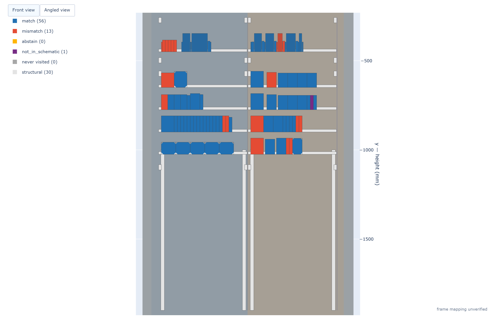

# AI Inspection Agent

Voice-guided inspection of an electrical control cabinet, checked against its
schematic: the trainee is told where to look, never what to expect.



*Run `20260927-130613`, 70 items: blue matched, red disagreed, purple names
nothing in this cabinet, grey is metalwork.*

> **Advisory only.** The system flags and explains; it never passes or fails a
> cabinet. A qualified person reviews every flag and signs off.

## What it does

- **Prompts by location only** — "left frame, row 3, position 1". The expected
  value stays hidden until the verdict is fixed, so nothing primes the trainee.
- **Judges deterministically.** Reads are compared by string equality against the
  closed set of legal values, so a misread is never corrected into a valid-looking
  one. Unclear audio is re-asked, at most twice, then flagged.
- **Loses nothing.** The run never stops, flags cannot be closed or deleted,
  and the audio behind every attempt is kept so any flag can be replayed.

## Quickstart

Python 3.11 and [uv](https://docs.astral.sh/uv/). No GPU, no network, no key:
speech recognition is `faster-whisper`, running locally.

```bash
uv sync                                        # deps, and the dev group
uv run python -m redlining.session --scripted  # smoke test, no microphone
uv run streamlit run app.py                    # the page, with the 3D view
```

## Results

One run, one cabinet, 70 items, 10 planted faults. `k/n` with 95% Wilson
intervals, as printed by `redlining.score` (M5 by `block05_asr/score.py`):

| Metric | | Rate | 95% CI |
|---|---|---|---|
| Fault detection (M2) | 8/10 | 80.0% | [49.0, 94.3] |
| Redline precision (M1) — *provisional* | 8/10 | 80.0% | [49.0, 94.3] |
| Abstention (M3), ceiling 10% | 0/70 | 0.0% | [0.0, 5.2] |
| Outcomes matching the schematic | 56/70 | 80.0% | [69.2, 87.7] |
| Tags heard correctly (M5), standing attempts | 62/62 | 100.0% | [94.2, 100.0] |

Ten planted faults cannot pin a rate down narrowly, which is what the intervals are
for. M1 is provisional: a flag where nothing was planted counts false without
replaying the audio. Both misses were terminal-strip counts. The dispatch model is
Gemma, chosen on a *provisional* median latency of 0.47 s per request against Qwen's
1.33 s; its accuracy figures are superseded — see the 6 Oct [DECISIONS](docs/DECISIONS.md) entry.

## Repository

| Path | Contents |
|---|---|
| `src/redlining/prep/` | Blocks 1–3 and the fault draw: what runs before a walk |
| `src/redlining/speech/` | The input sources: a microphone, or a clip the page recorded |
| `src/redlining/inspection/` | One run: the loop, the LLM front end, the append-only log |
| `src/redlining/evaluation/` | Block 9: scoring a run, and the walker's card |
| `src/redlining/view/` | The 3D picture of the cabinet |
| `src/redlining/core/` | Shared and import-free: reads, normaliser, adjudicator, statistics |

`paths.py` sits above them with every file location and `app.py` stays at the root.
Each module is re-exported at its old flat path, so `redlining.score` and every `python -m redlining.<name>` still resolve.

## More

- [docs/GUIDE.md](docs/GUIDE.md) — every command and flag, the 3D viewer, the six metrics, block status, and what none of this can claim
- [REPRODUCE.md](REPRODUCE.md) — the exact command behind every thesis number
- [docs/DECISIONS.md](docs/DECISIONS.md) — what was decided, and what it cost
- [docs/architecture/](docs/architecture/README.md) — the layers and the one cycle
- [docs/CONTEXT.md](docs/CONTEXT.md) — specification, assumptions, open questions

## License

Code under the [MIT License](LICENSE). The cabinet data and media (`data/`, plus
`docs/Cabinet_Components_Overview.jpeg` and `docs/BLOCK_GUIDE.pdf`) are included for reproducibility only, are **not** covered by it, and may not be reused freely.
